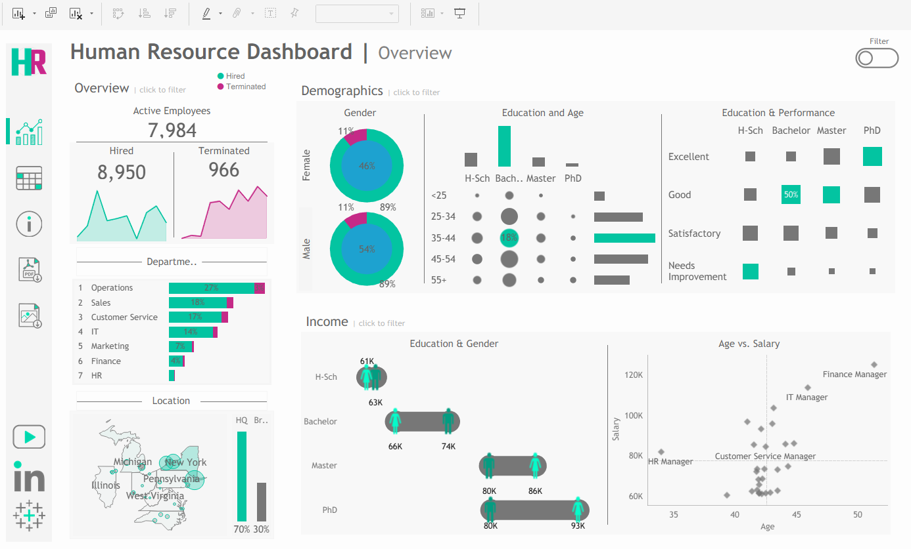
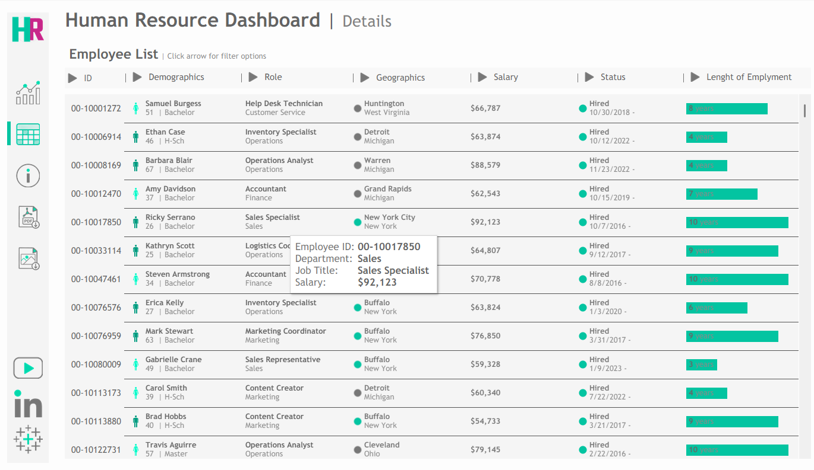

# HR Analytics Dashboard | Tableau

## Project Overview

This is a **guided learning project** completed by following the Tableau HR Dashboard tutorial by **Data With Baraa**.

The project helped me practice building interactive Tableau dashboards and analyzing HR data.

## Skills Practiced

* Tableau
* Data Visualization
* Dashboard Design
* Calculated Fields
* Filters & Interactivity
* HR Data Analysis

## Dashboard Pages

### 1. HR Overview

Provides an overview of:

* Hired and terminated employees
* Department and location distribution
* Gender demographics
* Education and age
* Employee performance
* Salary analysis

### 2. Employee Details

Provides detailed employee-level information with interactive filtering and navigation.

## Attribution

This dashboard was recreated as a learning exercise by following the **Data With Baraa** Tableau tutorial. The project concept, dataset, requirements, and original dashboard design were provided by Data With Baraa.

**Original Tutorial:**
https://www.youtube.com/watch?v=UcGF09Awm4Y

**Data With Baraa:**
https://www.datawithbaraa.com/
